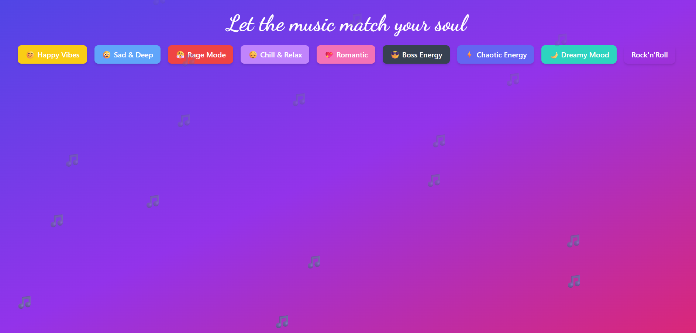
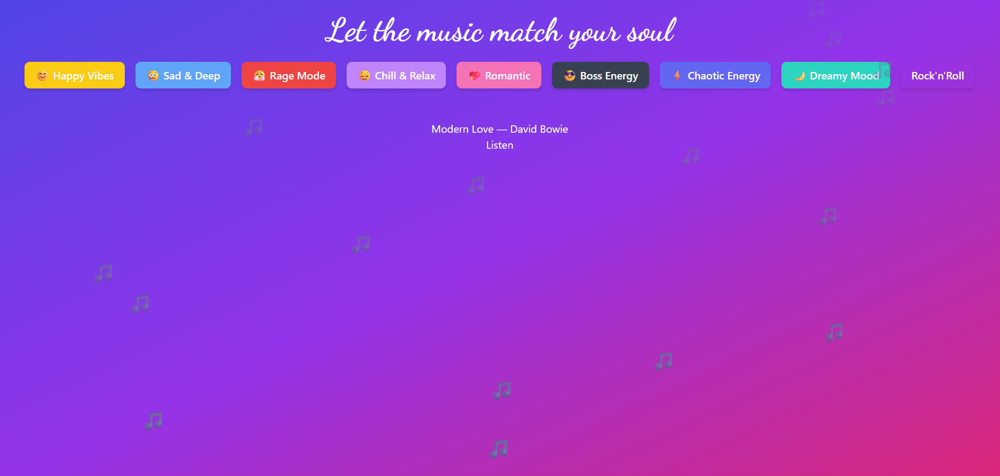

# Mood Music Recommender 🎵

A simple web application that recommends songs based on the selected mood.  
Each time you click a mood button, a random track is shown with a link to listen on Spotify.

## 🚀 Features

- 9 moods to choose from (happy, sad, chill, angry, etc.)
- Each mood returns a random song from a preset list
- Frontend built with React and Tailwind CSS
- Backend built with FastAPI (Python)
- Live Spotify links

## 📸 Screenshots




## 🧠 How It Works

- Mood buttons trigger a fetch request to the FastAPI backend.
- FastAPI returns a random song from the preconfigured list.
- Frontend dynamically displays the song title and its Spotify link.

## 🛠️ Project Structure

```text
MOOD_PROJECT/
├── backend/          # FastAPI application (main.py, data.py)
├── frontend/         # React application (src, tailwind config, package.json)
├── venv/             # Python virtual environment
└── requirements.txt  # Python dependencies
```

## Installation & Running app

1. Clone the repository .

```bash
git clone https://github.com/Daryamdev/Mood_Project.git
cd Mood_Project
```


2. Setup and Run Backend
open a terminal in the root folder and run:

```bash
# Create and activate virtual environment
python -m venv venv
# On Windows (CMD):
venv\Scripts\activate
# On macOS/Linux:
source venv/bin/activate

# Install dependencies
pip install -r requirements.txt

# Start the FastAPI server
uvicorn backend.main:app --reload
```
